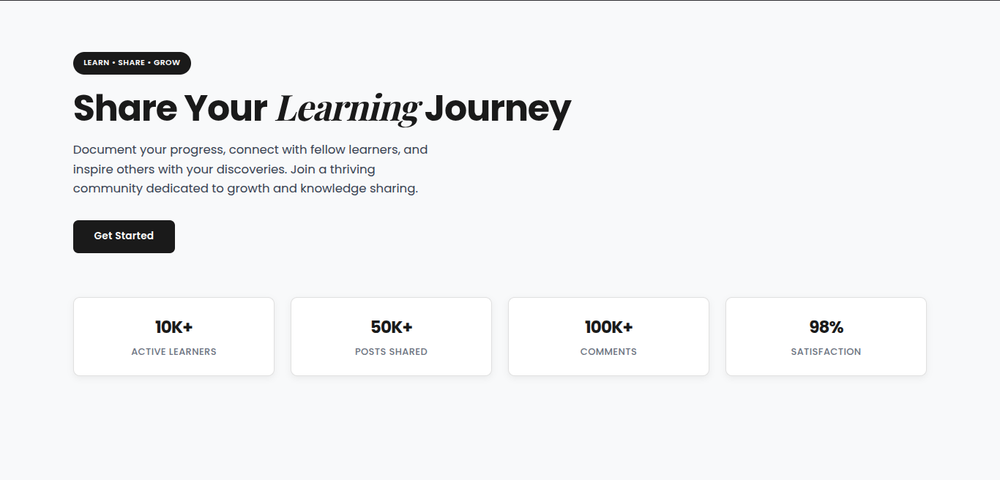
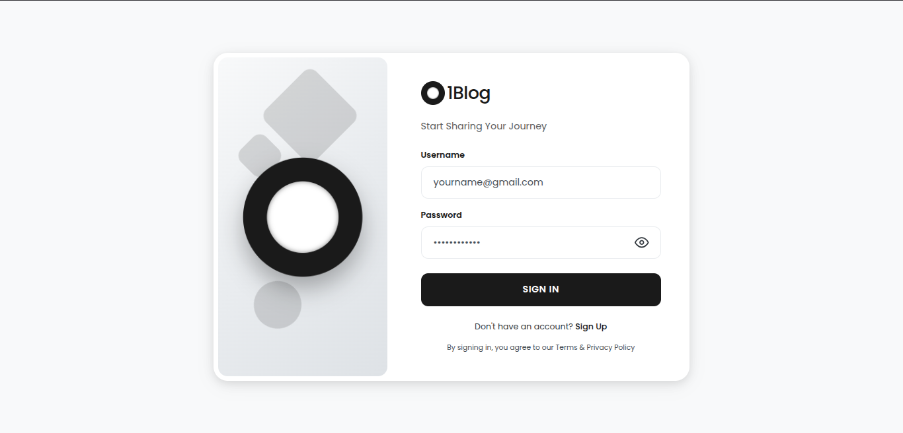
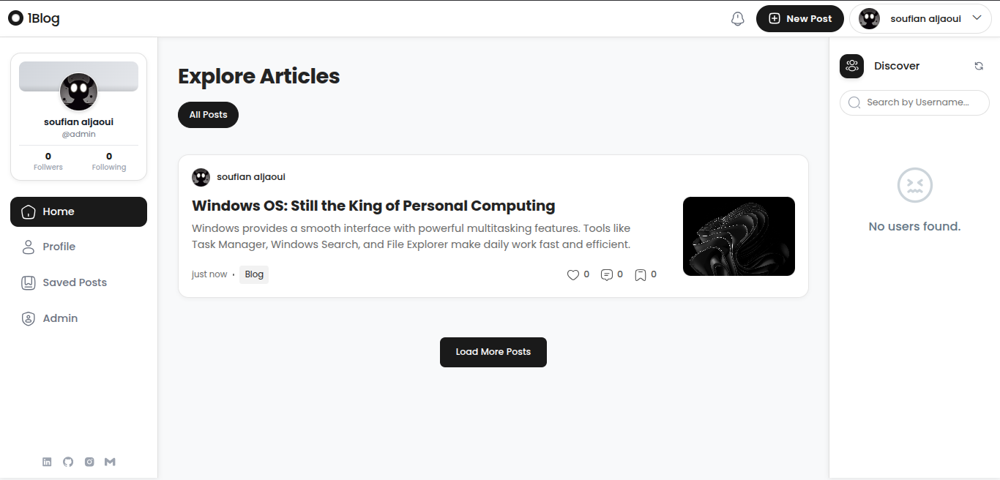
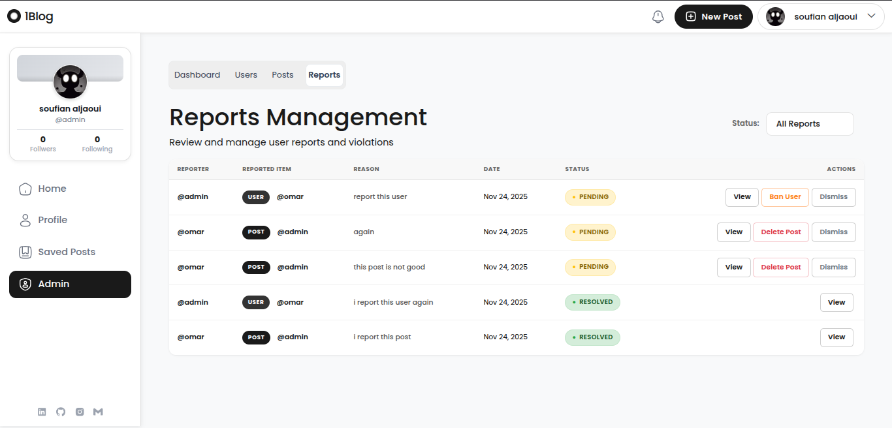

## 01Blog – Social Blogging Platform

01Blog is a fullstack blogging platform where students can share their learning journey, publish posts, interact with others, and build a learning community.
Built using Spring Boot (Java) and Angular.

## Project Preview

### Wlc Page

### Login Page

### Home Page

### Admin Dashboard

## Features

### User Features

Register and login using JWT
Create, edit, and delete posts
Upload images or videos
Like and comment on posts
View and follow other users
Receive notifications from subscribed users
Personal profile (Block page)
Report users for inappropriate behavior

### 🛡 Admin Features

Admin dashboar
View and manage all users
Ban or delete users
Remove inappropriate posts
Review reports with timestamps and reasons

## 🛠 Tech Stack

### Backend

Java Spring Boot
Spring Security + JWT
JPA / Hibernate
PostgreSQL / MySQL
File storage (Local or AWS S3)

### Frontend

Angular
Angular Material and Bootstrap
RxJS
Responsive UI

### ✔ Completed Features

Authentication
Role-based access
CRUD posts
Media upload
Likes & comments
Subscriptions
Notifications
Reports
Admin tools
Responsive UI

### 👨‍💻 Author

Soufian Aljaoui
GitHub: https://github.com/saljaoui

### 📄 License

This project is for educational purposes for Zone01 Oujda.